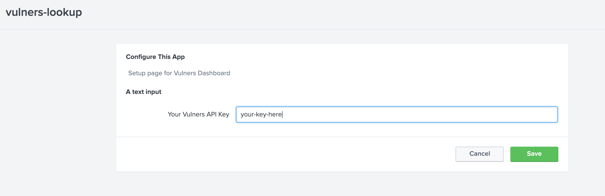

# Splunk - Vulners App

Vulners Application for Splunk allows you to collect information about your system packages and their vulnerabilities


```
index=vulners | lookup vulnerslook os version package | stats list(cve) as cve values(fix) as fix by package 
```

## Installation

Current [Distro](./result/vulners-lookup-0.0.1.tar.gz) contains both Dashboard and Forwarder installations

#### 1. Install Dashboard App

 - In Splunk dashboard go to 
    
    Apps -> Install app from file -> choose [vulners-lookup-*.tar.gz](./result/vulners-lookup-0.0.1.tar.gz)

 - Set data receiver, go to 
    Settings -> Forwarding and receiving -> Configure receiving -> New Receiving port


- [restart](https://docs.splunk.com/Documentation/Splunk/8.0.3/Admin/StartSplunk) Splunk Enterprise


#### 2. Install Forwarder App


 - Install following Python libs on forwarder machines 
    ```bash 
    pip3 install distro getmac ifaddr futures
    ```

 - unpack vulners_lookup.tar.gz into **$SPLUNK_FORWARDER_HOME/etc/apps/**

 - [restart](https://docs.splunk.com/Documentation/Forwarder/8.0.3/Forwarder/Starttheuniversalforwarder) Splunk Forwarder

#### 3. Add Vulners-API key

 - get API key at https://vulners.com/
  
  
 - add key in Splunk Vulners Dashboard 
 
 